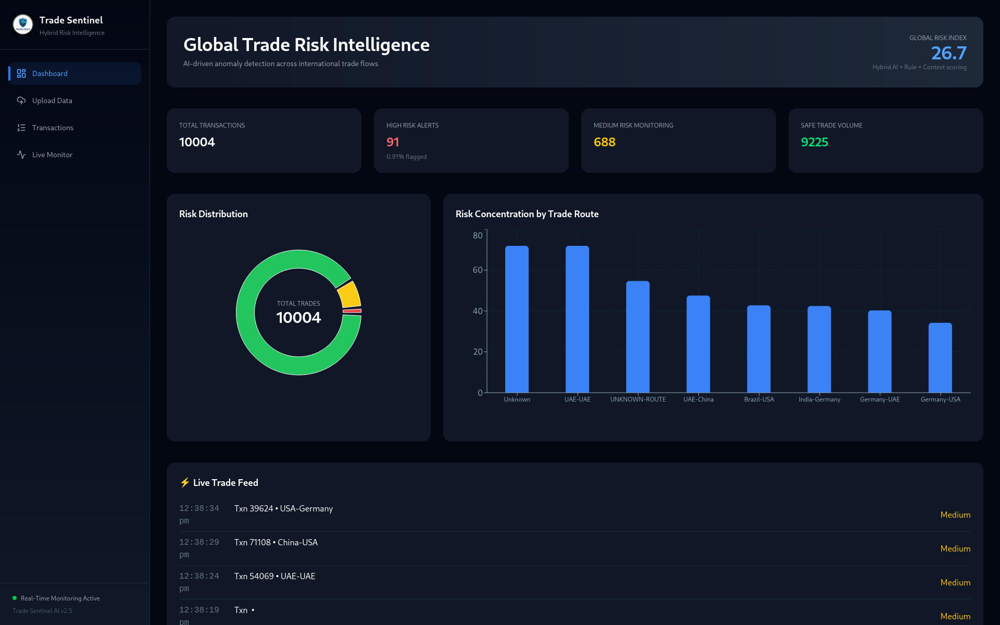
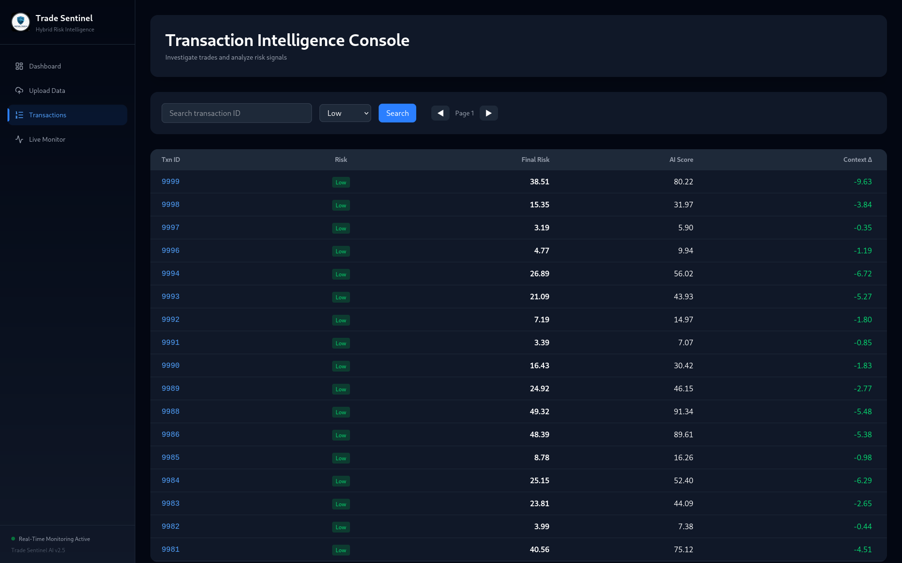
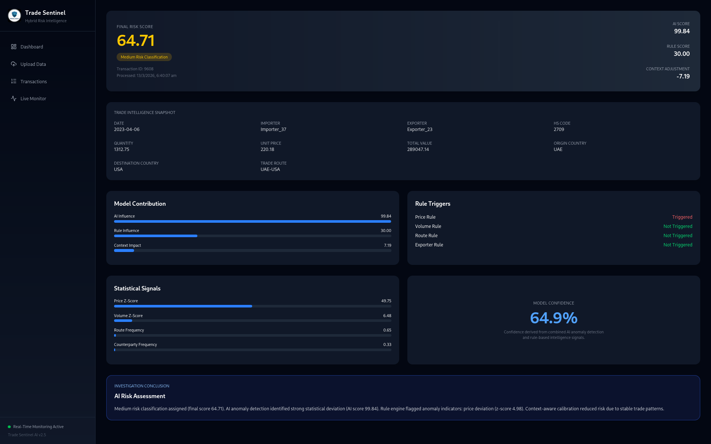
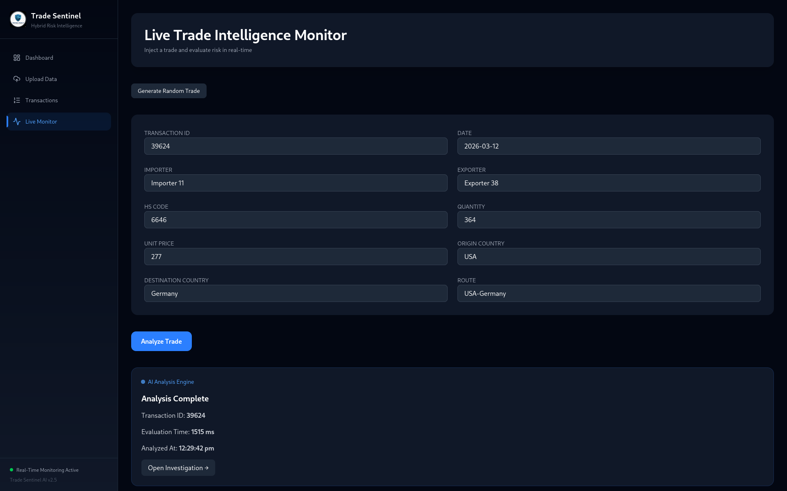

# 🚀 Trade Sentinel AI v2.5

## Context‑Aware Hybrid Trade Risk Intelligence Platform

Trade Sentinel AI is a full‑stack anomaly detection platform designed to identify suspicious international trade transactions while reducing false positives using contextual behavioral calibration.

The platform combines **machine learning**, **statistical anomaly detection**, **rule‑based intelligence**, and **contextual risk adjustment** to produce explainable trade risk assessments suitable for real‑world compliance and monitoring systems.

---

# 🧠 Project Overview

Trade‑based fraud such as:

* Over‑invoicing
* Under‑invoicing
* Abnormal trade routing
* Suspicious counterparties

is difficult to detect using traditional rule‑based monitoring systems.

Legacy monitoring tools often suffer from:

* High false‑positive rates
* Alert fatigue for investigators
* Static detection logic
* Limited explainability

Trade Sentinel AI introduces a **hybrid intelligence architecture** that combines statistical modeling, machine learning, deterministic rules, and contextual calibration to improve detection accuracy while maintaining operational efficiency.

---

# ✨ Major Features (v2.5)

## ⚡ Live Trade Intelligence Monitor

Version 2.5 introduces a **real‑time trade injection system** allowing analysts to simulate suspicious transactions and evaluate risk instantly.

Capabilities:

* Manual trade transaction injection
* Real‑time hybrid risk evaluation
* Immediate anomaly detection
* Investigation workflow initiation

This feature enables dynamic testing of fraud scenarios and real‑time monitoring.

---

## 📊 Advanced Risk Intelligence Dashboard

The platform provides a global overview of trade activity and anomaly signals including:

* Total transaction metrics
* High‑risk alert tracking
* Risk distribution visualization
* Risk concentration by trade route
* Global risk index
* Real‑time trade activity feed

These insights help analysts quickly identify abnormal patterns across trade flows.

---

## 🔎 Investigation Intelligence Engine

The **Transaction Detail Investigation Interface** provides explainable risk analysis.

Each investigation includes:

* Final hybrid risk score
* AI anomaly score
* Rule engine score
* Context adjustment impact
* Trade metadata (HS code, route, counterparties)
* Statistical anomaly signals
* Model contribution breakdown
* Rule trigger indicators
* Investigation explanation summary
* Model confidence indicator

This transforms the platform into a **full trade investigation console**.

---

## 💾 Persistent Risk Intelligence Storage

Version 2.5 introduces persistent transaction storage.

Benefits include:

* Historical investigation records
* Stored anomaly analysis
* Long‑term monitoring
* Searchable trade intelligence database

---

## 🔍 Transaction Intelligence Console

Investigators can:

* Search transactions
* Filter risk classifications
* Inspect anomaly scores
* Launch detailed investigations

This acts as a centralized investigation interface for trade monitoring.

---

# 🧠 Hybrid Detection Architecture

```
Trade Data
     ↓
Feature Engineering
     ↓
Isolation Forest (AI Anomaly Score)
     ↓
Rule Engine (Compliance Signals)
     ↓
Hybrid Risk Model
     ↓
Context‑Aware Calibration
     ↓
Final Risk Score
     ↓
Explainable Investigation Dashboard
```

---

# 🔬 Core Detection Components

## Feature Engineering

Category‑aware statistical normalization is applied to avoid global bias.

Features include:

* Price Z‑Score grouped by HS code
* Volume Z‑Score
* Trade route frequency
* Counterparty frequency

This ensures anomaly detection is **context‑aware and product‑specific**.

---

## AI Model — Isolation Forest

The system uses **Isolation Forest** for unsupervised anomaly detection.

Key properties:

* Multi‑dimensional anomaly detection
* No labeled fraud dataset required
* Efficient for large datasets

Anomalies require fewer partitions in isolation trees, producing higher anomaly scores.

---

## Rule‑Based Compliance Engine

A deterministic rule engine simulates regulatory checks.

Example rules:

| Condition        | Score |
| ---------------- | ----- |
| Price Z > 5      | +40   |
| Price Z > 3      | +30   |
| Volume Z > 5     | +30   |
| Volume Z > 3     | +20   |
| Rare Trade Route | +20   |
| Rare Exporter    | +10   |

Rule score capped at **100**.

---

## Hybrid Risk Fusion

Machine learning signals and rule‑based indicators are combined.

```
raw_risk = 0.6 × ai_score + 0.4 × rule_score
```

Risk classification:

| Risk Level | Score |
| ---------- | ----- |
| High       | ≥ 75  |
| Medium     | ≥ 50  |
| Low        | < 50  |

---

## Context‑Aware Calibration

The context layer reduces false positives while preserving high‑risk alerts.

Rules:

* High‑risk alerts are never suppressed
* Medium/low alerts may be reduced if trade behavior is stable
* Suppression capped at **20%**

```
FinalRisk = RawRisk × ContextFactor
ContextFactor ∈ [0.8 , 1.0]
```

---

# 📊 Platform Interface

## Risk Intelligence Dashboard



---

## Transaction Intelligence Console



---

## Investigation Detail View



---

## Live Trade Intelligence Monitor



---

# ⚙️ Technology Stack

## Backend

* FastAPI
* SQLAlchemy
* Pandas
* NumPy
* Scikit‑learn
* SQLite / PostgreSQL

## Frontend

* React
* Vite
* Tailwind CSS
* Recharts
* React Router

---

# 🏗 Project Structure

```
Trade‑Sentinel‑AI
│
├── trade‑risk‑backend
│   └── app
│
├── trade‑risk‑frontend
│
├── assets
│
├── README.md
└── LICENSE
```

---

# 🚀 Local Setup

## Backend

```
cd trade-risk-backend

python -m venv venv
source venv/bin/activate

pip install -r requirements.txt

uvicorn app.main:app --reload
```

API

```
http://127.0.0.1:8000
```

Docs

```
http://127.0.0.1:8000/docs
```

---

## Frontend

```
cd trade-risk-frontend

npm install
npm run dev
```

Frontend

```
http://localhost:5174
```

---

# 📈 Key Strengths

* Hybrid AI + rule‑based anomaly detection
* Context‑aware false positive reduction
* Real‑time trade monitoring
* Explainable investigation workflow
* Persistent intelligence storage
* Scalable architecture

---

# 📜 License

MIT License

---

# 👨‍💻 Author

**Sai Shashank**

Cybersecurity × Artificial Intelligence

Building intelligent, adversarial‑resilient systems.
